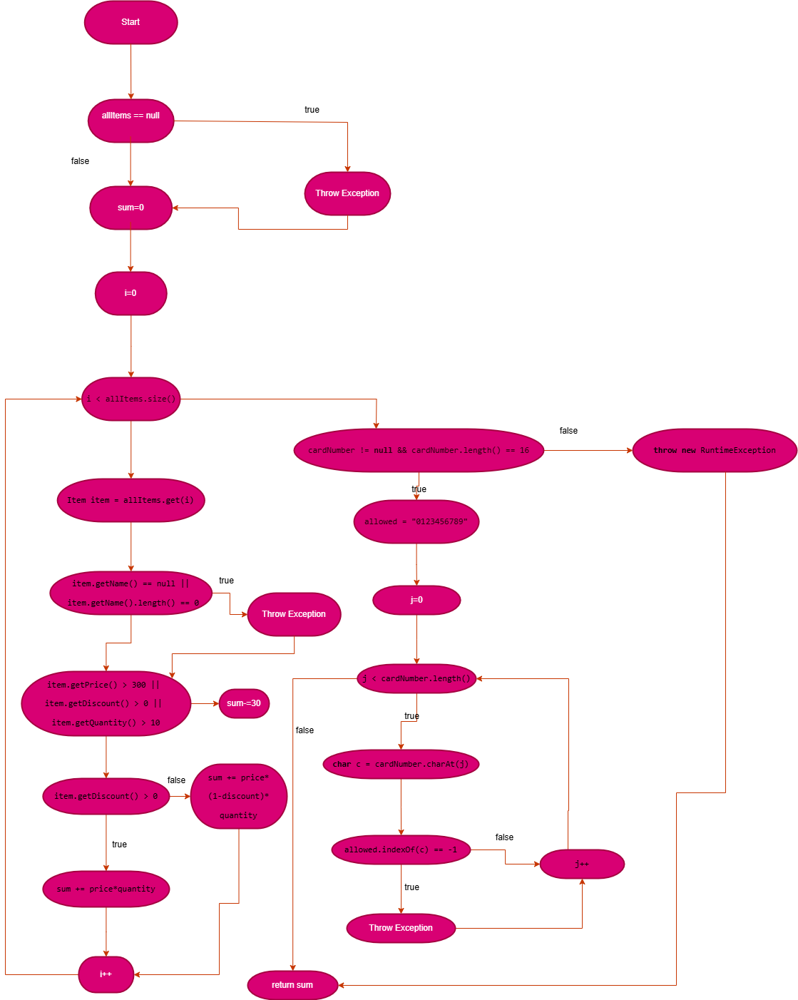

# SI_2025_lab2_236003
# Мила Крајческа 236003
### Control Flow Graph

### Цикломатска комплексност
Цикломатската комплексност на функцијата е пресметана со формулата: V(G) = P + 1
каде што P претставува бројот на предикатни јазли (условни проверки) во кодот, кои во нашиот случај се 8.
Значи, цикломатската комплексност на функцијата изнесува 9.

### Тест случаи според Every Statement критериумот

За да се постигне овој критериум, напишав 5 тест случаи кои ги покриваат сите наредби во функцијата:

- **TC1:**  
  `allItems == null`  
  Тестира дали се фрла `RuntimeException` со порака дека листата не смее да биде null.

- **TC2:**  
  Пример предмет со `item.getName() == null`  
  Тестира дали се фрла `RuntimeException` со порака за невалиден предмет.

- **TC3:**  
  Предмет со цена > 300 и попуст > 0  
  Проверка дали пресметката на сумата со попуст и одземање на 30 од сумата е точна.

- **TC4:**  
  Валиден предмет без попуст  
  Проверка на точна пресметка на сумата без попуст.

- **TC5:**  
  Предмет со валидни параметри и картичка, за позитивен тек на програмата.

---

### Тест случаи според Multiple Condition критериумот

Тестовите ги покриваат сите комбинации на условот:  
`if (item.getPrice() > 300 || item.getDiscount() > 0 || item.getQuantity() > 10)`

Минимално 4 тест случаи:

- **TXX:** Само цената е > 300  
- **FTX:** Само попустот е > 0  
- **FFT:** Само количината е > 10  
- **FFF:** Ниту еден од условите не е точен

Секој тест случај проверува дали пресметаната сума е точна за дадените услови.

---

### Објаснување на unit тестовите

- Во **Every Statement** тестовите се користат `assertThrows` за проверка на фрлање на исклучоци кај невалидни влезови и `assertEquals` за проверка на точноста на пресметката кај валидни предмети.  
- Во **Multiple Condition** тестовите се користи `assertEquals` за да се провери дали логичките комбинации на условите во `if` изразот се обработуваат правилно и резултираат со точна пресметка.

